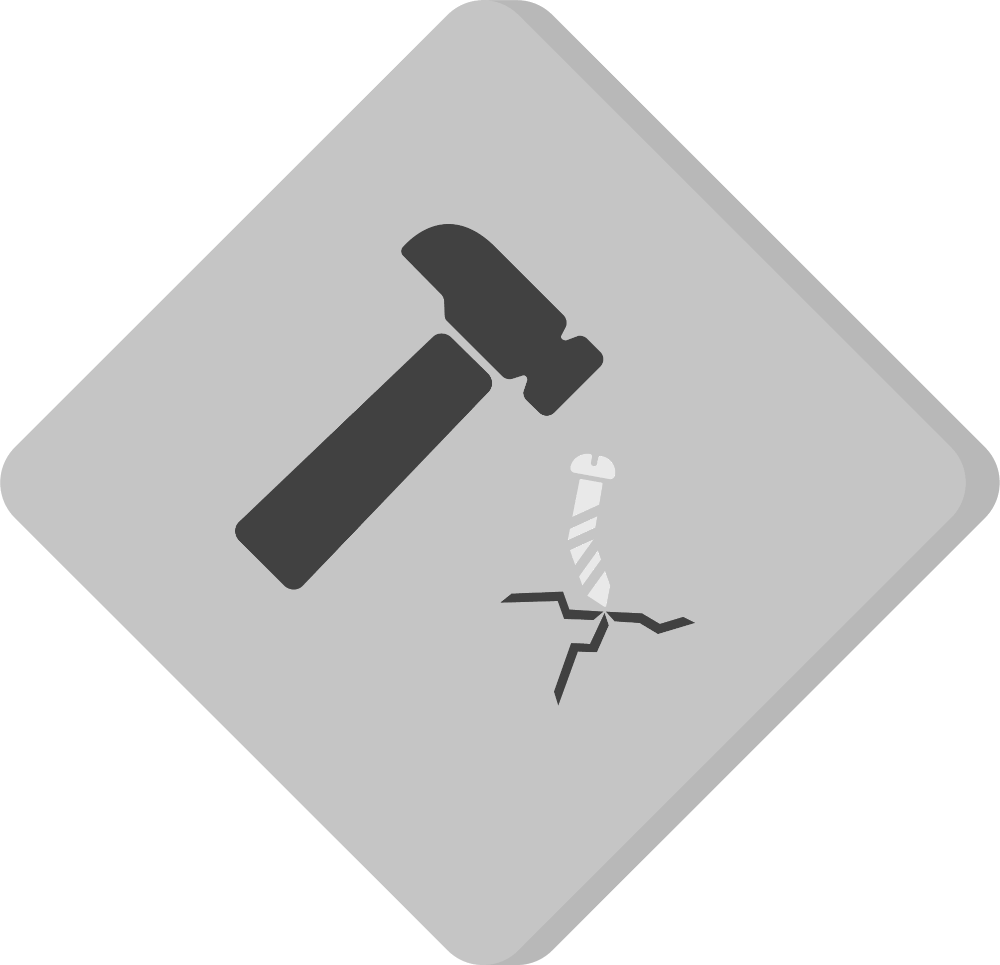
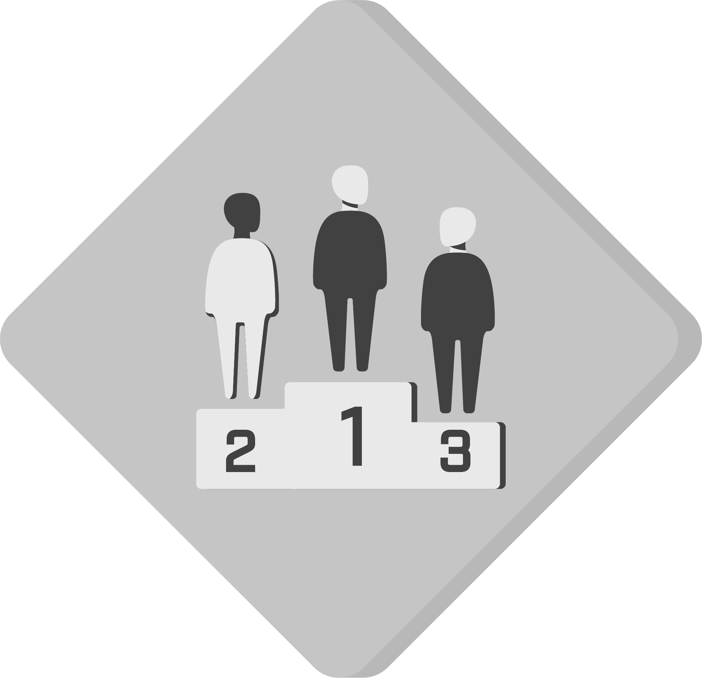
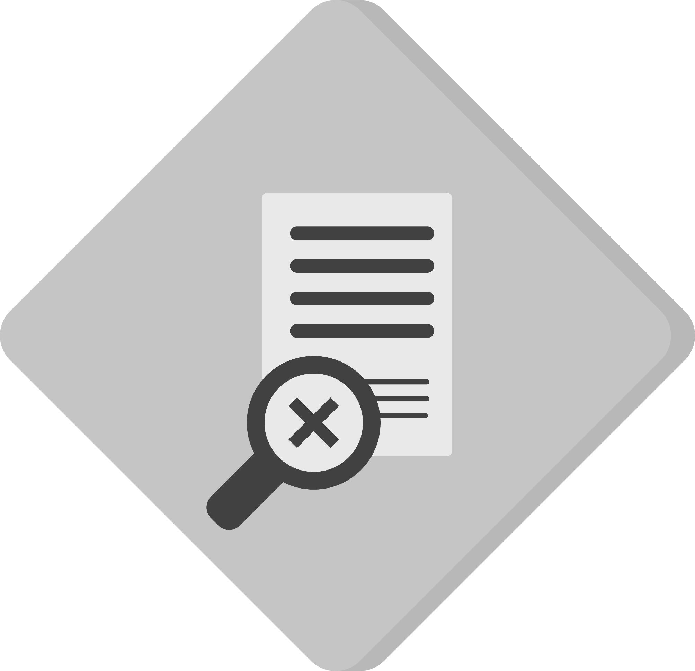

# Example of a project using data hazards

> [!WARNING]
> This repository may contain references internal to NHS England that cannot be accessed publicly

This repository is a mock-up of how a data science project at NHS England could communicate what might go wrong in data science projects, using the labels from the Data Hazards Project.

You can find out more about the Data Hazards Project on the [website][1].

## Contact

This repository is maintained by the NHS England Data Science Team.

To contact us raise an issue on Github or via [email][2].

See our other work on our [website][3].

## Description

We are thinking about how we can use the Data Hazard labels to talk about ethical hazards in data science projects in the data science team at NHS ENgland. This README.md contains an example of how this might look.

> [!IMPORTANT]
> This does not constitute official policy and is an experimental piece of work.

## Prerequisites

An awareness of the [Data Hazards project][1].

## Licence

Any documentation is © NHS England copyright and available under the terms of the Open Government 3.0 licence.

## Hazards

|  |  |  | | | | |
|:-:|:-:|:-:|:-:|:-:|:-:|:-:|
|  |  |  |  |  |  |  |

## Acknowledgements

* [Harriet Sands](https://github.com/harrietrs)
* [Mia Noonan](https://github.com/amelianoonan1-nhs)

[1]: https://datahazards.com/about.html
[2]: mailto@datascience.nhs.net
[3]: https://nhsengland.github.io/datascience/
